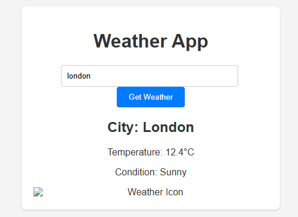

## 🌤️ **Weather Prediction Web App**

This is a simple weather prediction web application built using **HTML**, **CSS**, and **JavaScript**, which allows users to search for real-time weather information of any city using the **WeatherAPI**.

---

## 🔍 Features

- 🔎 Search weather by city name
- 🌡️ Displays:
  - Temperature in Celsius
  - Weather condition (e.g., Cloudy, Sunny)
  - City name
  - Weather icon
- 📱 Responsive layout for all screen sizes
- ⚡ Real-time data using [WeatherAPI](https://www.weatherapi.com/)

---

## 🛠️ Tech Stack

- **Frontend**: HTML5, CSS3, JavaScript (Vanilla JS)
- **API**: WeatherAPI (https://www.weatherapi.com/)

---

## 📂 Project Structure

```

weather-prediction-app/
│
├── index.html         # Main HTML structure
├── styles.css         # CSS styling
├── script.js          # JavaScript logic and API integration
└── README.md          # Project documentation

````

---

## 🚀 How to Run Locally

1. **Clone the repository**

```bash
git clone https://github.com/SANJEEV-00/weather-prediction-app.git
cd weather-prediction-app
````

2. **Get your free API key from WeatherAPI**

   * Visit: [https://www.weatherapi.com/](https://www.weatherapi.com/)
   * Sign up for a free account
   * Navigate to your dashboard and copy your API key

3. **Update the API key in `script.js`**

```javascript
const API_KEY = 'YOUR_API_KEY'; // Replace with your actual key
```

4. **Open `index.html` in your browser**

> ✅ No installation or server setup needed – works fully in the browser.

---

## 📸 Screenshots

> 

---

## 🧪 Sample Cities to Test

* London
* New York
* Chennai
* Tokyo
* Sydney

---

## 🌐 API Endpoint Used

**Current Weather Endpoint (WeatherAPI)**
`https://api.weatherapi.com/v1/current.json`

---

## 💡 Future Enhancements

* 📍 Auto-detect user location using Geolocation API
* 📅 5-day or 7-day weather forecast
* 🕒 Show local time of the selected city
* 🎨 Dark mode / light mode toggle
* 🌐 Support for multiple languages or units (°F/°C)

---

## 🙋‍♂️ Author

**Sanjeev D**
🎓 B.Tech - Artificial Intelligence and Data Science
🌐 [Portfolio](https://sanjeev-portfolio-48.lovable.app)
🐙 [GitHub](https://github.com/SANJEEV-00)

---

## 📜 License

This project is open-source and free to use under the [MIT License](LICENSE).

---

> 💬 *Feel free to fork, use, and improve this project. Pull requests are welcome!*


Let me know if you want help generating the `LICENSE` file (MIT) or deploying this app on GitHub Pages with a live link.

